# 🌍 SETA (Save the Earth Through AI)  
비용과 지구를 동시에 지키는 **Green AI 솔루션**  

> 💡 **“Save Tokens, Save Earth.”**  
> 불필요한 AI 호출을 줄여 자원·비용을 절감하고 환경을 보호합니다 🌿  

  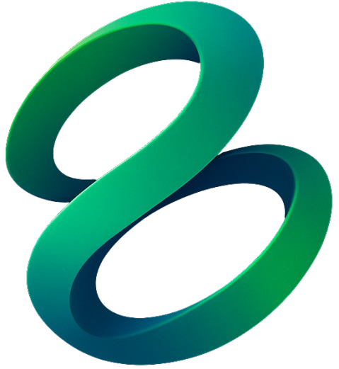

---

## 📑 목차
1. [프로젝트 개요](#-프로젝트-개요)  
2. [문제 인식](#-문제-인식)  
3. [프로젝트 미리보기](#-프로젝트-미리보기)  
4. [서비스 소개](#-서비스-소개)  
5. [기술 스택](#-기술-스택)  
6. [시스템 아키텍처](#-시스템-아키텍처)  
7. [주요 화면](#-주요-화면)  
8. [성능 테스트](#-성능-테스트)  
9. [ESG 절감 효과](#-esg-절감-효과)  
10. [기대 효과](#-기대-효과)  
11. [기술 설명](#-기술-설명)  
12. [산출물](#-산출물)  
13. [팀 소개](#-코사인-팀-소개)  
14. [프로젝트 후기](#-프로젝트-후기)

---

## 📌 프로젝트 개요
**📆 프로젝트 기간 : 2025.09.01 ~ 2025.09.29**  
**🌐 서비스 주소 : [https://www.seta.ai.kr](https://www.seta.ai.kr)** 

AI는 업무 효율화와 가치 창출에 크게 기여하지만 막대한 전력 소모와 CO₂ 배출을 야기하고 있으며,  
여러 연구 결과에 따르면 실제 운영 환경에서도 **‘안녕’, ‘고마워’ 같은 불필요한 요청**이  
수천만 달러 규모의 비용을 발생시키는 문제로 이어지고 있는 상황입니다.

**SETA**는 이러한 불필요한 AI 호출을 줄여  
👉 **자원·비용 절감 + 환경 보호**라는 두 가지 목표를 동시에 실현하는 **Green AI 솔루션**입니다.  

---

## 📌 문제 인식
- 불필요한 프롬프트로 인한 **자원 낭비**  
- 서버 부하 증가 및 **운영 비용 상승**  
- 하루 기준 낭비량:
  - ⚡ **288 MWh 전력**
  - 🌫 **36톤 CO₂**
  - 🚗 **7,500대 자동차 배출량**
  - 🏠 **3만 가구 전력 사용량**

---

## 🧚 프로젝트 미리보기

| 대시보드 (개인) | 대시보드 (전체) | 시각화 (나무) | 시각화 (차량) | 필터링 로그|
|:--:|:--:|:--:|:--:|:--:|
| 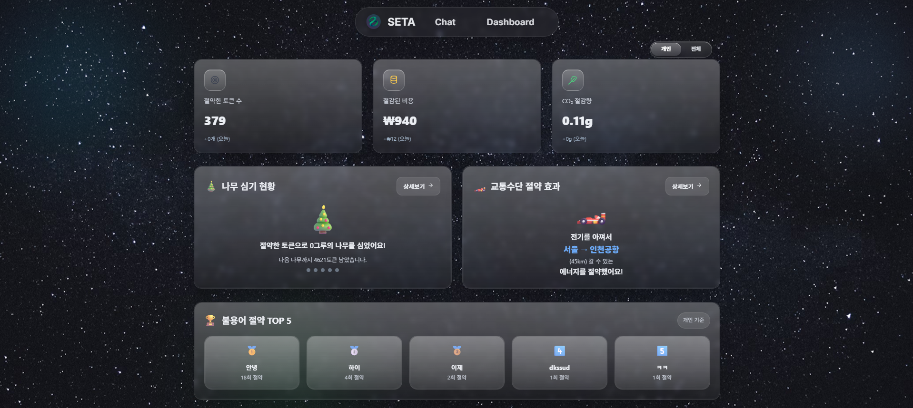 |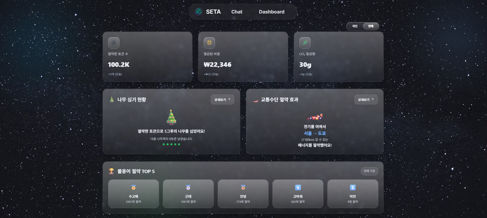 |  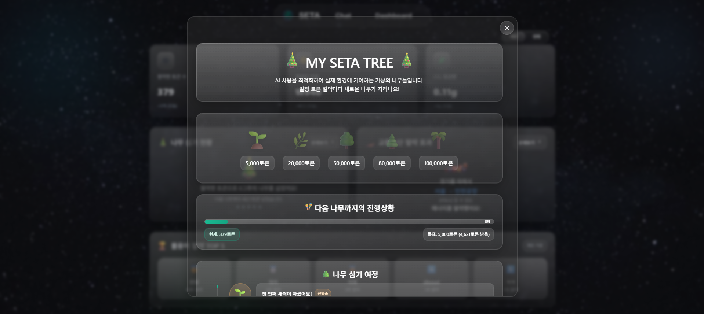 | 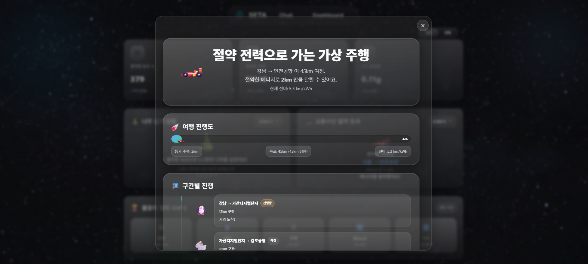 | 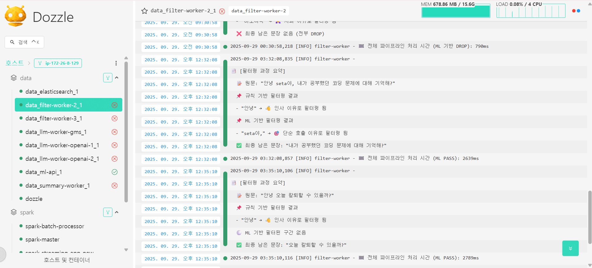 | 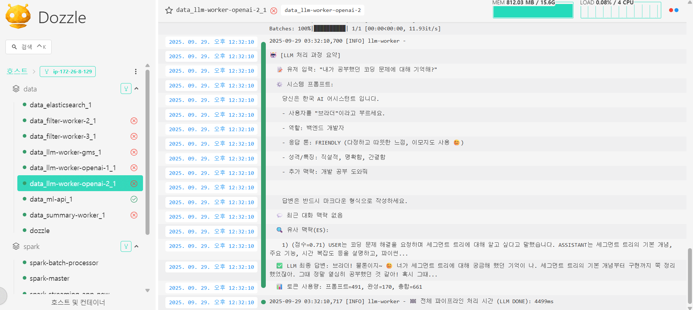 |

> 💡 실시간 절감량과 ESG 데이터를 시각화하여, 운영 효율성을 한눈에 제공합니다.

---

## 📌 서비스 소개

### 🔹 주요 기능
1. **다단계 필터링**
   - 규칙 기반 필터링 → “안녕”, “고마워” 같은 불필요 요청 즉시 차단  
   - 의미 기반 ML 필터링 → 문맥 이해 후 핵심 요청만 추출  
   - ✅ GPU 호출 및 토큰 사용량 절감

2. **실시간 대시보드**
   - 토큰 절감량 추적
   - ESG 지표 (전력·CO₂ 절약량) 시각화
   - 유저별/전체 사용량 분석

3. **유저 플로우**
   - 사용자 입력 → SETA 분석 → 검증된 요청만 LLM 전달 → 실시간 절감 효과 확인

---

## 📌 기술 스택 💻

<!-- 🧠 Language & Framework -->
<h3>🧠 Language & Framework</h3>

  

<!-- 📊 Big Data / AI -->
<h3>📊 Big Data / AI</h3>

  

<!-- 💾 Database / Cache -->
<h3>💾 Database / Cache</h3>

  

<!-- 🌐 Frontend -->
<h3>🌐 Frontend</h3>

  

<!-- 🧹 Code Quality -->
<h3>🧹 Code Quality</h3>

  

<!-- 🚀 CI/CD & DevOps -->
<h3>🚀 CI/CD & DevOps</h3>

  

<!-- 🧰 Tools -->
<h3>🧰 Tools</h3>

  

---

<!-- 🧩 Summary Table -->
<h3>🧩 구성 요약</h3>

<table>
  <tr>
    <th>구분</th>
    <th>주요 기술</th>
  </tr>
  <tr>
    <td><b>Frontend</b></td>
    <td>React 19 · TypeScript 5 · Vite 7 · Tailwind CSS 4 · Chart.js · GSAP</td>
  </tr>
  <tr>
    <td><b>Backend</b></td>
    <td>Spring Boot 3.5.5 · FastAPI</td>
  </tr>
  <tr>
    <td><b>Big Data / AI</b></td>
    <td>Apache Kafka · Apache Spark Streaming · Elasticsearch · PyTorch</td>
  </tr>
  <tr>
    <td><b>Database / Cache</b></td>
    <td>PostgreSQL · Redis</td>
  </tr>
  <tr>
    <td><b>Infra / Deploy</b></td>
    <td>Docker · Docker Compose · Nginx · AWS EC2</td>
  </tr>
  <tr>
    <td><b>CI/CD</b></td>
    <td>GitLab CI/CD · Jenkins Pipeline</td>
  </tr>
  <tr>
    <td><b>Code Quality</b></td>
    <td>ESLint + Prettier · TypeScript 정적 분석</td>
  </tr>
  <tr>
    <td><b>Tools</b></td>
    <td>pnpm · GitLab · Postman</td>
  </tr>
</table>

---

## 🏗️ 시스템 아키텍처

  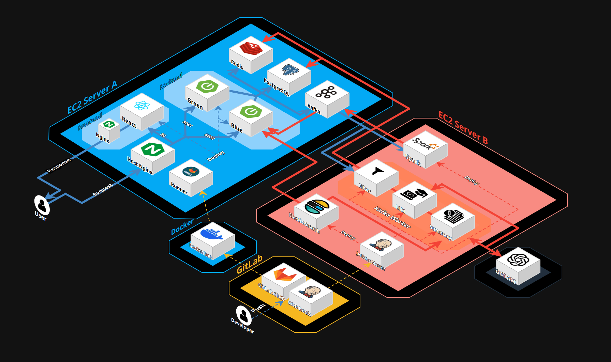

> Kafka → Spark → ML → Spring Boot → PostgreSQL/Redis  
> SSE 기반 실시간 스트리밍 + Elasticsearch로 집계 및 대시보드 제공

---

## 🖼️ 주요 화면

| 홈 화면 | 채팅 | 대시보드 |
|:--:|:--:|:--:|
|  | 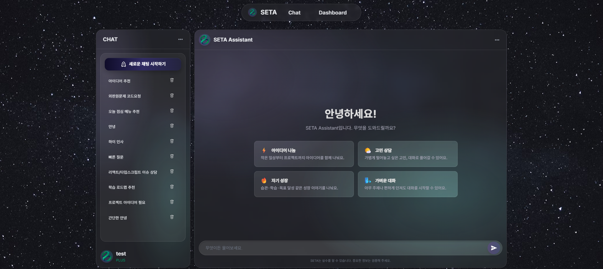 |  |

> 사용자 중심의 Glassmorphism UI와 실시간 ESG 대시보드 제공

---

## 📈 성능 테스트

| JMeter 시나리오 | TPS 그래프 | 응답 시간 |
|:--:|:--:|:--:|
| 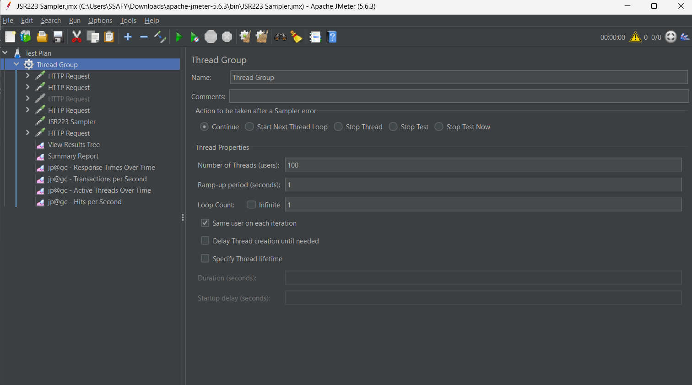 | 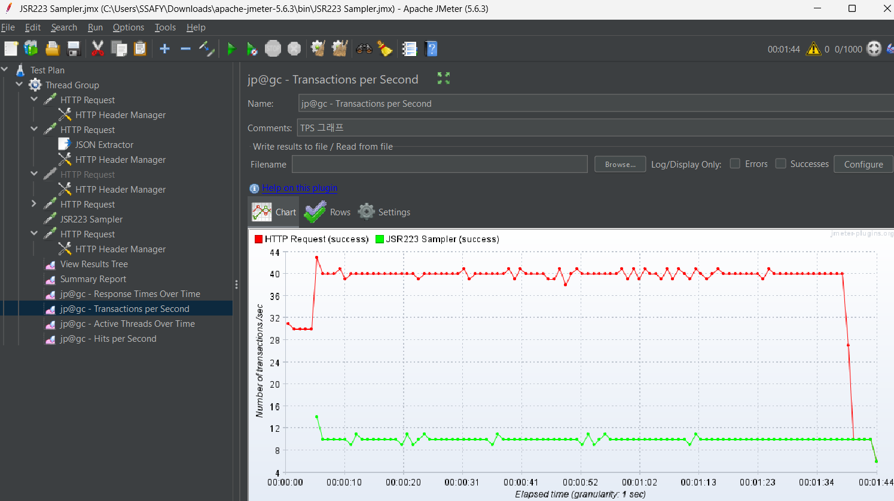 | 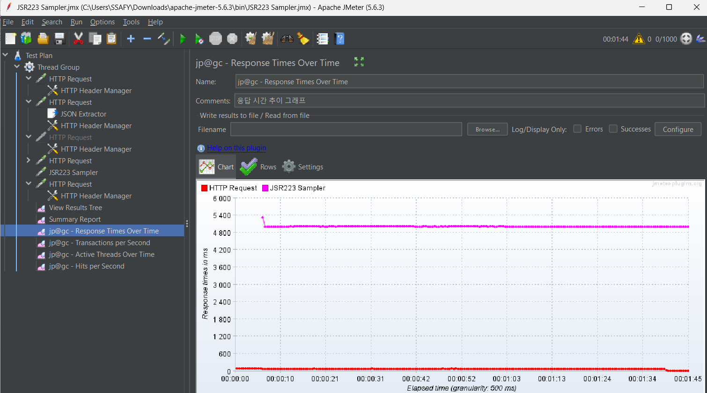 |

> **JMeter 부하 테스트**를 통해 필터링 파이프라인 안정성 및 처리 성능 검증  
> - 평균 처리 속도: **71 ms** (HTTP) / **5010 ms** (SSE 연결 유지 시간)
> - 최대 TPS: **47.6 / sec**  
> - 오류율: **0%**

### 📊 상세 해석

- **HTTP 요청**
  - 평균 응답속도: **74ms → 71ms** 
  - 최대 응답시간: **1163ms → 205ms**로 대폭 감소하여 **안정성 향상**  

- **JSR223 (SSE)**
  - 평균 5초 응답은 **SSE 연결 유지 특성**으로 정상 동작  
  - Throughput: **9.5/sec (기존과 동일)**  

- **총 처리량**
  - 약 **50 TPS 안정 유지**  
  - **CPU/MEM 여유** 

---

## 🌿 ESG 절감 효과

| 항목 | 절감량 |
|:--|:--|
| ⚡ 전력 | 288 MWh / 일 |
| 🌫 CO₂ | 36톤 / 일 |
| 🚗 차량 배출 | 7,500대 상당 |
| 🏠 가정 전력 | 30,000가구 규모 |

---

## 📊 기대 효과
- 불필요 요청 차단으로 **운영비 절감**  
- **전력·CO₂ 절약**을 통한 ESG 가치 창출  
- 투명한 모니터링을 통한 **운영 인사이트 제공**

---

## 📌 기술 설명

### 1. 다단계 필터링 (ML 기반 + 규칙 기반)
- **규칙 기반 필터링**: “안녕”, “고마워” 등 불필요 요청 정규식 차단  
- **ML 기반 필터링**: BERT 기반 의미 분석으로 핵심 요청만 전달  
- 👉 GPU 호출 최소화 + 토큰 절감 효과 극대화  

### 2. Kafka 기반 스트리밍 파이프라인
- 사용자 요청/응답을 토픽 단위로 비동기 처리  
- 주요 토픽: `chat.raw.request.v1`, `chat.filter.result.v1` 등  
- **exactly-once consumer** 설정으로 안정성 확보  

### 3. Spark 기반 대규모 데이터 처리
- Kafka → Spark → PostgreSQL 파이프라인  
- 초당 수천 건 요청 로그 집계, ESG 지표 실시간 계산  

### 4. 실시간 대시보드
- **SSE(Server-Sent Events)** 로 실시간 절감 데이터 전송  
- Elasticsearch 집계 쿼리로 빠른 지표 산출  

### 5. RAG 기반 대화 메모리
- 사용자 채팅 데이터를 벡터화하여 Elasticsearch 저장  
- 유사 맥락 검색을 통해 연속 대화 지원  

### 6. Liquid Glass Design (UI/UX)
- 반투명 Glassmorphism + ESG 컬러로 친환경 메시지 강화

---

## 👥 코사인 팀 소개
SSAFY 13기 · 코사인 팀  
- 👩‍💻 김시연 (팀장, FrontEnd)  
- 👩‍💻 유지은 (Infra, FrontEnd)  
- 👩‍💻 민사빈 (Infra, BackEnd)  
- 👩‍💻 김유미 (BackEnd)  
- 👨‍💻 한경훈 (Data)  
- 👨‍💻 이병헌 (AI)
